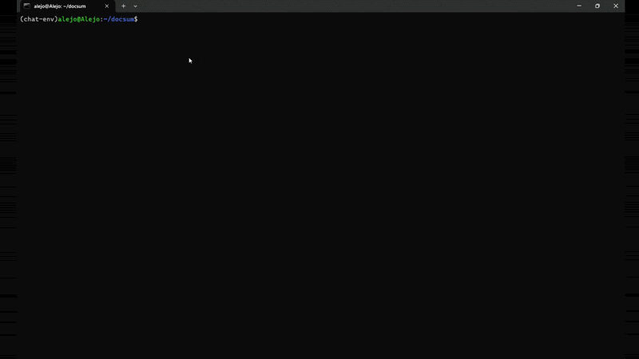

# Command-Line AI Agent with Tool Integration


<!-- your coverage badge is wrong for two reasons:
1. it shows 90% coverage, but your actual coverage report on github actions shows only 59% coverage :(
2. it is hardcoded and not automatically updated; coverage.io generates a badge that is automatically updated
--> 

This project provides a command-line chat agent that integrates with a language model and supports tool-based interactions for file operations and calculations. Users can interact using natural language or explicit slash commands, with tab completion enhancing usability and efficiency.



## Installation

<!-- your installation instructions below are incorrect;
if you follow these commands, then the usage commands will not work
(you never did `pip install .`; and if you do that,
there is no need to manually install dependencies)
-->
Clone the repository and install dependencies:

```bash
$ pip install -r requirements.txt
```

Set your API keys depending on the provider:

```bash
$ export GROQ_API_KEY=your_key_here
$ export OPENROUTER_API_KEY=your_key_here
```

## Usage

You need a sentence introducing every code block (### titles not good form);
you also need to include the `$` in front of every shell command;
(it is sometimes acceptable to not include the `$` if every code block on a page is only a shell command with no output, but that is not the case here, so you need the `$` on your commands)
```bash
$ chat
chat> what files are in the .github folder?
The only file in this folder is the workflows subfolder.
```

You can pass a message directly:

```bash
$ chat "what files are in the .github folder?"
The only file in this folder is the workflows subfolder.
...
```

Specify which model provider to use:

```bash
$ chat --provider openai
chat> What model are you?
I am GPT5.2 provided by OpenAI
```
<!-- notice how the code block is an exact example of something that could be copy/pasted from a terminal; it shows both what the user typed in and the possible output;
also notice in the list below, anything that a user could type into a terminal need to be in backticks -->
Supported providers:
- `groq` (default)
- `openai`
- `anthropic`
- `google`

### Debug Mode

Debug mode prints tool usage whenever a tool is invoked.

<!-- why `python3 chat.py` here and just `chat` elsewhere? -->
```bash
$ chat --debug
chat> /ls .github  
[tool] /ls .github  
The only file in this folder is the workflows subfolder.
```

## Example Queries on Projects

You should never have a section without a sentence in it;
the examples above are also usage examples, so this section needed a more descriptive title

### Markdown Compiler

This example demonstrates how the chat tool can analyze a codebase by searching for specific patterns across files.

```bash
cd test_projects/Markdown-to-HTML-compiler
chat
chat> does this project use regular expressions?
No. I grepped the project files and did not find any use of the `re` library.
```
This example is useful because it demonstrates how the agent uses the grep tool to analyze code structure across files.

### Ebay Scraper

This example demonstrates how the agent can summarize a project and answer higher-level questions about its purpose and implications.

```bash
cd test_projects/Ebay_webscrapping
chat
chat> tell me about this project
The project is designed to scrape product information from eBay listings.

chat> is this legal?
In general, scraping public webpages is often legal, although using an official API is usually more reliable and efficient.
```

This example is useful because it shows the agent can summarize a project and reason about broader implications.

### Personal Website

This example demonstrates how the tool can interpret and summarize the contents of a non-Python project.

```bash
cd test_projects/abedoya-norena.github.io
chat
chat> what does this project contain?
This project contains the files for a personal website, including HTML and related assets.

```
This example is useful because it demonstrates that the agent can interpret non-Python projects using file inspection.

<!-- I removed the safety and the features section because they read like AI slop; if you actually want to talk about those features, you do it with the examples -->
